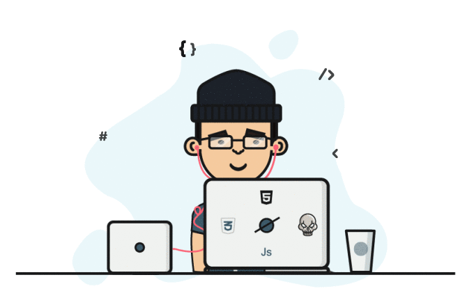
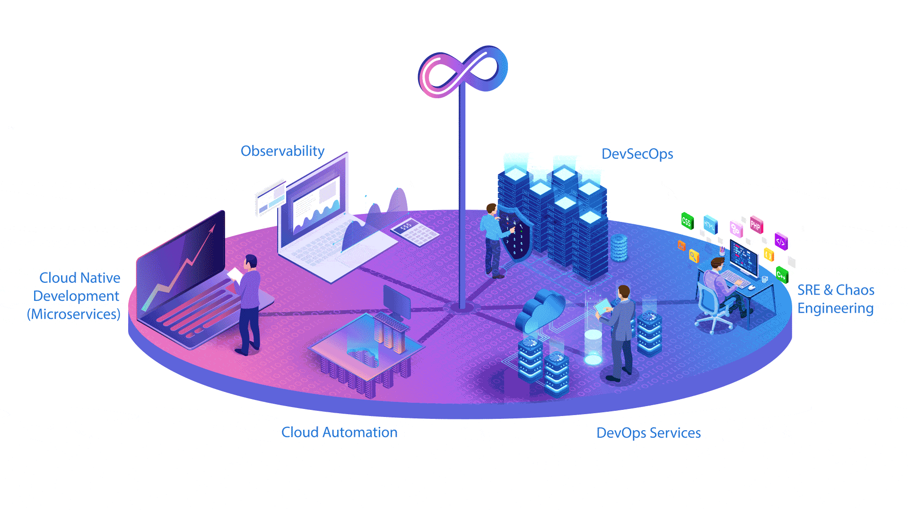

# Hi , I'm **Reteti Amason Lerionka**

<picture>
  <source media="(prefers-color-scheme: dark)" srcset="https://raw.githubusercontent.com/EngReteti/EngReteti/output/github-contribution-grid-snake-dark.svg">
  <source media="(prefers-color-scheme: light)" srcset="https://raw.githubusercontent.com/EngReteti/EngReteti/output/github-contribution-grid-snake.svg">
  
</picture>

## 👨‍💻 About
I am a Computer Science student at The Co-operative University of Kenya. My philosophy is simple: **master the core logic of programming before scaling to the cloud.** I am a dedicated problem solver focused on building efficient, maintainable software and transitioning into high-impact infrastructure roles.

* 🔭 **Now:** Deepening expertise in Java, Spring Boot, and Python.
* 🌱 **Learning:** DSA, Database Management, and Distributed Systems.
* ☁️ **Vision:** Evolving from Software Engineering to DevOps and Cloud Architecture.
* 🤝 **Community:** Passionate about giving back by sharing technical skills.

   
  
   

## **🛠️ Tech Stack </>** 

<table border="0">
  <tr>
    <td width="45%" align="center" bgcolor="#0d1117" style="border-radius: 15px 0 0 15px; padding: 20px; vertical-align: middle;">
      
    </td>
    <td width="55%" align="center" bgcolor="#0d1117" style="border-radius: 0 15px 15px 0; padding: 20px;">
      
<strong>Dev</strong>

      

        
        
        
        
        
        
        
      

      

      
<strong>Tools</strong>

      

        
        
        
        
        
        
        
        
        
      

    </td>
  </tr>
</table>

## 📊 Analytics

<table>
  <tr>
    <td width="50%" align="center">
        
      
    </td>
    <td width="50%" align="center">
      
    </td>
  </tr>
</table>

## 🛤️ Roadmap

* **Software Engineering** - Java, Spring Boot, React, and PostgreSQL for high-performance apps.
* **DevOps Engineering** - Bridging code and deployment with Docker, Kubernetes, and CI/CD.
* **Cloud Architecture** - Designing high-availability distributed systems on AWS/GCP.
* **AI/ML** - Exploring intelligent software using Python and FastAPI.

   
  
   

## 🧠 Skills
* **Problem Solving:** Decomposing complex technical challenges into logical parts.
* **Architecture:** Evaluating architectural integrity before implementation.
* **Standards:** Maintaining rigid, high-quality coding standards.
* **Mentorship:** Actively uplifting peers through open knowledge sharing.

## 📫 Connect

