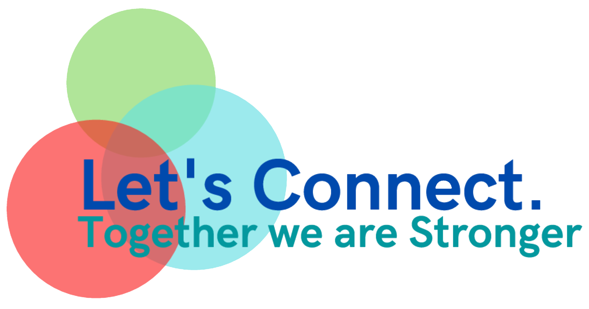

# Hi , I'm **Reteti Amason Lerionka**

<picture>
  <source media="(prefers-color-scheme: dark)" srcset="https://raw.githubusercontent.com/EngReteti/EngReteti/output/github-contribution-grid-snake-dark.svg">
  <source media="(prefers-color-scheme: light)" srcset="https://raw.githubusercontent.com/EngReteti/EngReteti/output/github-contribution-grid-snake.svg">
  
</picture>

## 👨‍💻 About Me
I am a Computer Science student at The Co-operative University of Kenya. My philosophy is simple: **master the core logic of programming before scaling to the cloud.** I am a dedicated problem solver focused on building efficient, maintainable software and transitioning into high-impact infrastructure roles.

* 🔭 **Current Initiative:** Deepening expertise in Java, Spring Boot, and Python.
* 🌱 **Deep Learning:** DSA, Database Management, and Distributed Systems.
* ☁️ **Vision:** Evolving from Software Engineering to DevOps and Cloud Architecture.
* 🤝 **Philanthropy:** Passionate about giving back to the community by sharing tech skills.

   
  
   

## **🛠️ Technical Ecosystem** 

<table>
  <tr>
    <td width="50%" align="left">
      
    </td>
    <td width="50%" align="left">
       
       
       
       
       
       
       
       
       
       
       
       
       
       
       
      
    </td>
  </tr>
</table>

## 📊 Analytics & Impact

<table>
  <tr>
    <td width="50%" align="center">
        
      
    </td>
    <td width="50%" align="center">
      
    </td>
  </tr>
</table>

## 🛤️ Professional Development Path

* **Current Focus: Software Engineering** - I believe in building a rock-solid foundation. I am currently deepening my expertise in **Java, Spring Boot, React, and PostgreSQL** to develop high-performance, user-centric applications before moving to complex infrastructure. 
* **Next Upgrade: DevOps Engineering** - Once my foundation is set, I will expand into DevOps to bridge code and deployment. I am eager to master **Docker, Kubernetes, CI/CD, and System Monitoring** to ensure my software is resilient and production-ready.

* **Future Goal: Cloud Architecture** - As an aspiring Cloud Architect, I am passionate about scaling into the cloud. I plan to master **AWS/GCP/Azure** to design high-availability, distributed systems that can serve global demands.

   
  
   

* **Keen Interest: AI/ML Engineering** - I am highly interested in the intersection of intelligence and software. I am exploring **Python** and **Machine Learning/Deep Learning** concepts, with a focus on deploying intelligent models using **FastAPI**.

## 🧠 Core Competencies
* **Analytical Problem Solving:** Decomposing complex technical challenges into logical parts.
* **Critical Thinking:** Evaluating architectural integrity before implementation.
* **Structural Logic:** Maintaining rigid, high-quality coding standards.
* **Collaboration & Mentorship:** Actively uplifting peers through open knowledge sharing.

## 📫 Let's Connect

   
  
   
   
  
   

